<h3><code>aditya@github ~ $ whoami</code></h3>

 
 

<h3><code>aditya@github ~ $ ./contributions.sh</code></h3>

 
 

<h3><code>aditya@github ~ $ ./stats.sh</code></h3>

 
 

<h3><code>aditya@github ~ $ ./links.sh</code></h3>

<b>Aspiring SDE</b>

<a href="https://github.com/Aditya05h/Pointly">Pointly</a> ·
<a href="https://github.com/Aditya05h/SurakshaSetu">SurakshaSetu</a> ·
<a href="https://github.com/Aditya05h/MaandiConnect">MaandiConnect</a>

 

